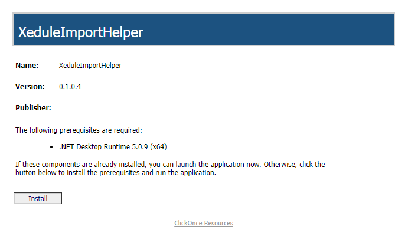
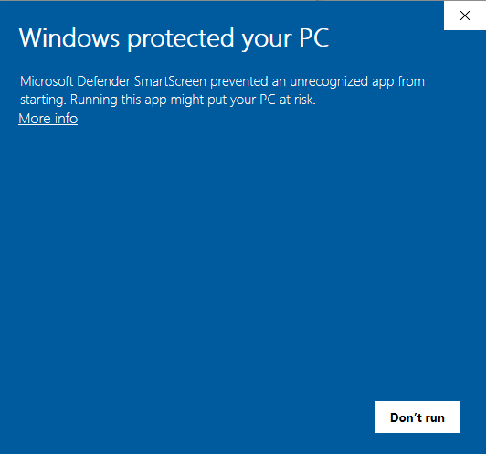
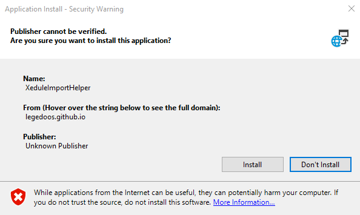
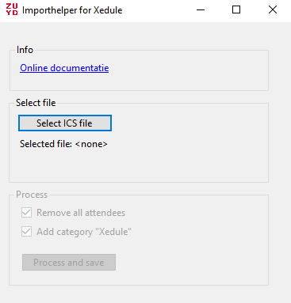

# Installatie
Om de applicatie te installeren moeten een paar stappen doorlopen worden. Tijdens deze stappen zullen een aantal veiligheidsmeldingen optreden. De reden voor deze meldingen is dat er geen certificaat beschikbaar is om codesigning te doen. De kosten voor dit certificaat staan niet in verhouding tot de functionaliteit van de applicatie.De code is open source  ([Github](https://github.com/LegeDoos/XeduleImport)) dus voel je vrij te controleren wat de software doet.

## Stap 1 - start de installer

Ga naar <a href="https://legedoos.github.io/XeduleImport/Installer/Publish.html" target="_blank">de installer</a> en klik install

De setup.exe file wordt gedownload. Dubbelklik om de setup uit te voeren.

## Stap 2 - Microsoft defender

Je krijgt onderstaande melding. Klik eerst op "More info" en vervolgens op "Run anyway"

## Stap 3 - Install

Negeer de veiligheidsmelding en klik op install.

## Stap 4 - Succes!

Na installatie zal de app openen op het startscherm

# Installatie van updates

De installer is zo gemaakt dat automatisch gecontroleerd wordt op updates en deze bij het starten van de applicatie worden gedownload en geïnstalleerd.

[Terug naar home](index.md)
