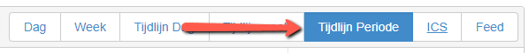
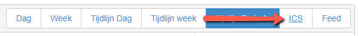
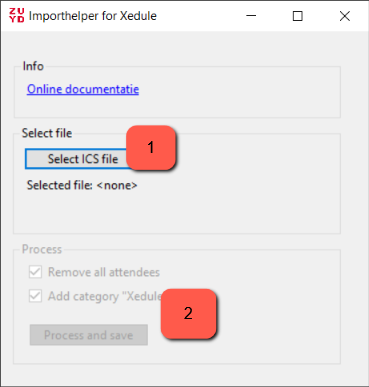
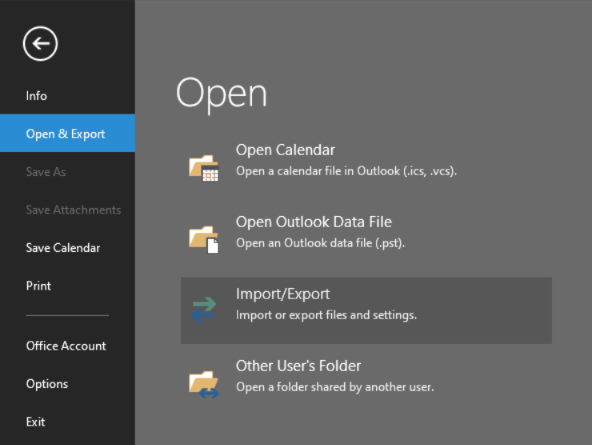
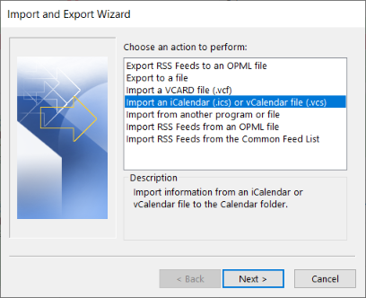
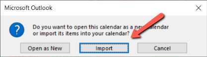

# Gebruikershandleiding

Om je rooster in Outlook te krijgen moeten er een aantal stappen worden uitgevoerd. Je moet een bestand downloaden uit Xedule. Dit bestand moet aangepast worden en vervolgens in Outlook worden geüpload. Deze stappen staan in onderstaande handleiding nader toegelicht. 

- [Download ICS bestand uit Xedule](#download-ics-bestand-uit-xedule)
- [Gebruik Xedule Importhelper](#gebruik-xedule-importhelper)
- [Voeg rooster toe aan Outlook](#voeg-rooster-toe-aan-outlook)
- [Verwijder rooster uit Outlook](#verwijder-rooster-uit-outlook)
- [Disclaimer](#disclaimer)

## Download ICS bestand uit Xedule

1. Ga naar Xedule voor je organisatie en log in. Voor Zuyd Hogeschool is dit https://sa-zuyd.xedule.nl/

2. Open je persoonlijk rooster en klik rechtsboven op de periode die je wilt downloaden. Handig is hier te kiezen voor "Tijdlijn periode", zodat het rooster van de gehele blokperiode wordt getoond en zometeen dus ook wordt gedownload. 

3. Klik op de knop ICS om het bestand te downloaden. Het bestand wordt geplaatst in de standaard downloadfolder van je browser 

Je bent nu klaar in Xedule

[Naar boven](#gebruikershandleiding)

## Gebruik Xedule Importhelper

1. Start "Importhelper for Xedule" op je taakbalk (als je die hebt gepind tijdens de installatie) of zoek in je Windows startmenu op "XeduleImportHelper"

   

2. Klik op de "Select ICS file" knop (1) om het gedownloade .ics bestand te selecteren

3. Kies de juiste opties bij "Process" (2)
    1. Remove all attendees: in het ics bestand worden alle tags "attendee" verwijderd (dit wil je) zodat je bij het verwijderen uit Outlook niet alle afspraken één voor één moet verwijderen (dit wil je niet).
    2. Add category "Xedule": voeg aan alle afspraken een tag "Xedule" toe. Deze tag heb je nodig om straks alle afspraken weer uit je Outlook agenda te verwijderen indien nodig (dit wil je).

5. Klik op de knop "Process and save". Een nieuw, aangepast, .ics bestand wordt nu in dezelfde map opgeslagen.

[Naar boven](#gebruikershandleiding)

## Voeg rooster toe aan Outlook

Onderstaand staan de stappen om je rooster toe te voegen middels de Outlook desktop applicatie.

1. Start de Outlook desktop applicatie en ga naar je agenda.
2. Zorg dat alleen de agenda zichtbaar is waarin je wilt importeren
3. Ga naar menu File > Open & Export > Import/Export 
   
   
4. Kies voor "Import an iCalendar (.ics) or vCalendar file (.vcs) 
   
   
5. Selecteer het aangepaste .ics bestand
6. Kies in het volgende scherm voor "import" 
   
   

Het bestand wordt succesvol geïmporteerd en is zichtbaar in je agenda.

[Naar boven](#gebruikershandleiding)

## Verwijder rooster uit Outlook

1. Start de Outlook desktop applicatie en ga naar je agenda.
2. Type rechtsboven in de "Search Calendar (ctrl+E) box op "Xedule"
3. Selecteer in de lijstweergave alle items die aan je voorwaarden voldoen en klik delete.

Alle events worden nu verwijderd. 

[Naar boven](#gebruikershandleiding)

## Disclaimer

Software is geleverd as-is en gebruik is op eigen risico.
